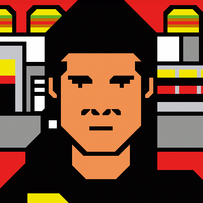

# StegMe

> Steganography is the technique of hiding secret data within an ordinary, non-secret, file or message in order to avoid detection; the secret data is then extracted at its destination.

StegMe is a steganography tool that can encrypt (i.e. hide) text into an image, and decrypt an imagine to get the hidden text.

# Installation
Clone/Download this GitHub repo.\
Install dependencies using `pip install -r dependencies.txt`

# Usage
**Encryption**
```
cd encryption
python3 encrypt.py [input text file] [input image] [output image]
```

**Decryption**
```
cd decryption
python3 decrypt.py [output text file] [output image]
```

# Working

We use the LSB (least-significant bit) method.
1 pixel contains 8 bits of red, 8 bits of green and 8 bits of blue. The encoding/decoding is done in 3-2-3 fashion. The last 3 bits of red, the last 2 bits of green and the last 3 bits of blue are used to store 8 bits (or 1 byte) of the message text. We make an assumption that all charcters to be encoded belong to ASCII-128. This is just for convenience; else we would require more pixels to encode a single byte of text message.

## Example of Working

**Message byte**: **010** **11** **101**

**Original Pixel**:
| Red | Green | Blue |
| -- | -- | -- |
| 11010**101** | 101011**01** | 01110**111** |

**Modified pixel**:
| Red | Green | Blue |
| -- | -- | -- |
| 11010**010** | 101011**11** | 01110**101** |

## Worst Case Scenario
**Q.** What is the maximum possible offset in a single pixel?\
**A.** For the red and blue part, we use the last 3 bits. These encode 4+2+1=7 bits (out of a total of 2^8 = 256). So, the maximum possible offset is +- 7.\
For the green part, we use the last 2 bits. These encode 2+1=3 bits (out of a total of 2^8 = 256). So, the maximum possible offset is +- 3.\
These values are small enough to be un-noticeable by the naked human eye.

## Example of Image

| Original Image | Modified Image |
| -- | -- |
|  |  |
